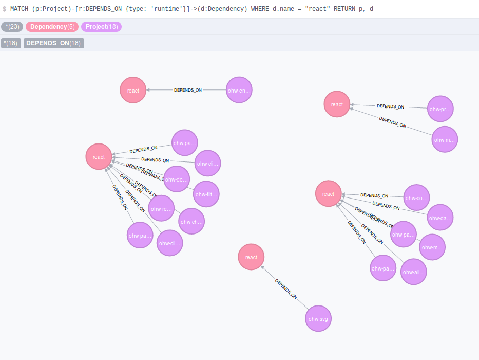
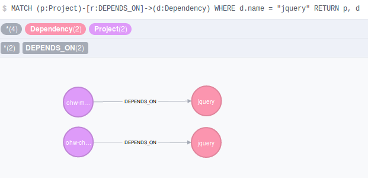
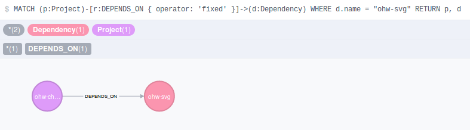

## Dependency Graph

`Map projects dependencies into a neo4j database. Useful for auditing or living documentation.`

# Requirements

* git
* node v7+
* docker

# Installation

```bash
git clone https://stash/users/lucass/repos/dep-graph/
cd dep-graph/
npm install
```

# Run

1) `Fetch dependencies information`
```bash
npm start run:fetcher
```

2) `Run the database`
```bash
npm start run:database
```

3) `Navigate to http://localhost:7474 and run the queries in the queries folder`


# Example

`Return all versions of a dependency and their consumers`



`No one is still using jQuery ... right ??`



`How many project are fixed to a specific version of ohw-svg ?`



### And much more...
