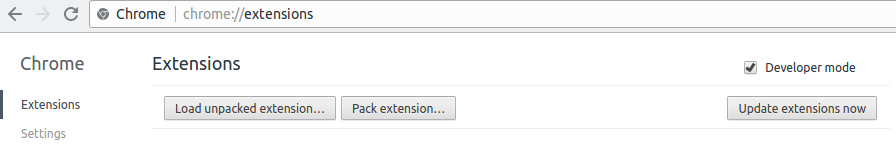

EMRC Context Detection Chrome Plugin
====================================

* Install the extension

    Navigate to `chrome://extensions` and click `Load unpacked extension...` and select this folder
    

* Install dependencies

    ```bash
    npm install
    ```

* Run the project

    ```bash
    npm start
    ```

* Open `http://localhost:8080`